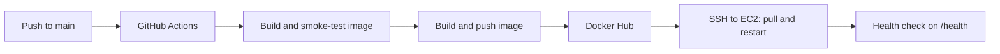

   # Dockerized Website with GitHub Actions CI

   

   A small website packaged with Docker and Nginx. On every push to `main`, a GitHub Actions pipeline builds the Docker image and runs automated smoke tests. Deploying to AWS EC2 is planned as the next step.

   ## Full pipeline (target design)

   Implemented now: the first stages (push, GitHub Actions, build and smoke-test). The Docker Hub and EC2 stages are planned.



1. A push to `main` starts the workflow in `.github/workflows/ci.yml`.
2. The `test` job builds the image, starts it, and runs `scripts/smoke-test.sh` against it. If a test fails, nothing is published.
3. The `build-and-push` job builds the image from the `Dockerfile` and pushes it to Docker Hub with two tags: `latest` and the short commit id.
4. The `deploy` job connects to the EC2 server over SSH, pulls `latest`, and replaces the running container.
5. The job then calls `/health` and fails the run if the site does not answer.

## Tech stack

| Area | Tool |
|---|---|
| Cloud | AWS EC2 (Ubuntu), Security Groups (planned) |
| Containers | Docker (Docker Hub planned) |
| Web server | Nginx (alpine image) |
| CI/CD | GitHub Actions |
| Scripting | Bash (smoke tests, server setup, monitoring) |

## Project structure

```
.
├── app/index.html               The website
├── nginx.conf                   Nginx config, including the /health endpoint
├── Dockerfile                   Builds the image and stamps the commit id into the page
├── scripts/setup-ec2.sh         One-time Docker install on the server
├── scripts/smoke-test.sh        Tests run by the pipeline before publishing
├── scripts/monitor.sh           Health check and log file for the server (cron)
└── .github/workflows/ci.yml The CI/CD pipeline
```

## Run it locally

```bash
docker build -t aws-ec2-docker-cicd .
docker run --rm -p 8080:80 aws-ec2-docker-cicd
```

Open http://localhost:8080. Locally the page shows `local` as the commit id, because the pipeline fills in the real one.

## Set it up yourself

**1. EC2 server.** Launch an Ubuntu instance and open ports 22 (SSH) and 80 (HTTP) in its security group. Connect and run:

```bash
bash scripts/setup-ec2.sh
```

Log out and back in so Docker works without `sudo`.

**2. Docker Hub.** Create a public repository named `aws-ec2-docker-cicd` and an access token with read and write permission.

**3. GitHub secrets.** In the repository, go to Settings, Secrets and variables, Actions, and add:

| Secret | Value |
|---|---|
| `DOCKERHUB_USERNAME` | Your Docker Hub username |
| `DOCKERHUB_TOKEN` | The Docker Hub access token |
| `EC2_HOST` | Public IP address of the EC2 instance |
| `EC2_USER` | `ubuntu` |
| `EC2_SSH_KEY` | Full contents of the `.pem` key file |

**4. Push to `main`.** The pipeline runs, and the site is live at `http://<EC2_HOST>`.

## Testing

The pipeline runs `scripts/smoke-test.sh` on every push. It checks that `/health` answers `ok`, that the home page loads, that the commit id was stamped into the page, and that an unknown URL returns 404. You can run the same checks locally:

```bash
docker run -d --name site-test -p 8080:80 aws-ec2-docker-cicd
bash scripts/smoke-test.sh http://localhost:8080
docker rm -f site-test
```

## Monitoring and logs

On the server, `scripts/monitor.sh` checks `/health`, writes a timestamped line to `~/site-monitor.log`, and restarts the container if the check fails. Run it every 5 minutes with cron:

```bash
git clone https://github.com/HimanshuRaj02/aws-ec2-docker-cicd.git
crontab -e
# add this line at the end:
*/5 * * * * bash /home/ubuntu/aws-ec2-docker-cicd/scripts/monitor.sh
```

Useful commands for troubleshooting:

```bash
docker ps                      # is the container running?
docker logs website            # Nginx access and error logs
tail -n 20 ~/site-monitor.log  # recent health checks
```

## Security notes

- The `.pem` key and all credentials are stored only as GitHub secrets. They are never committed (see `.gitignore`).
- SSH uses key-based login only.
- Port 22 is open to the internet because GitHub-hosted runners do not have a fixed IP address. A stricter setup would use a self-hosted runner, AWS Systems Manager, or temporarily allow the runner's IP during deployment.
- The site is served over HTTP. Adding HTTPS (a domain plus a certificate) would be the next step.

## Possible improvements

- Create the EC2 instance and security group with Terraform.
- Add HTTPS with a domain name and a certificate.
- Add a staging environment that is tested before production.
- Send the monitoring results to CloudWatch and set up an alarm.
- Replace SSH deployment with AWS Systems Manager.

## License

MIT
